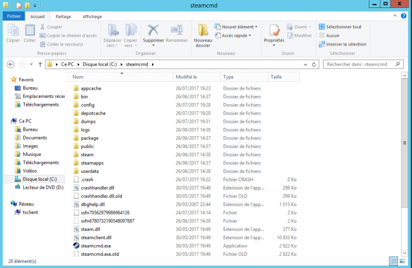
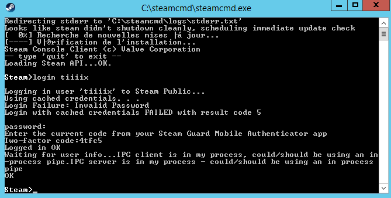
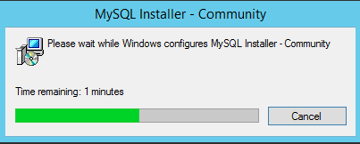
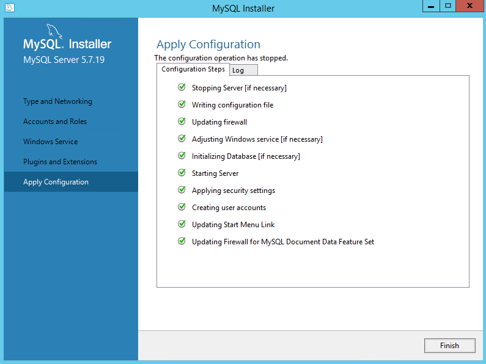
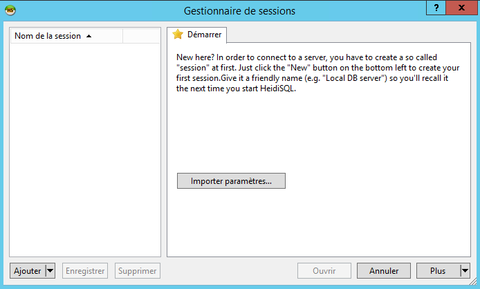

# Installation et configuration sous Windows

## **Installations des logiciels et applications de base**

Pour partir sur de bonnes bases, vous devez avoir quelques logiciels pour gérer votre serveur, que voici : 

* [Google Chrome](https://www.google.fr/chrome/browser/desktop/index.html) \(car Internet Explorer est trop sécurisé, et donc pas simple d'utilisation\)
* [WinRar ](http://www.win-rar.com/predownload.html?&L=10&Version=64bit)\(pour gérer vos archives compressées\)
* [PBOManager ](http://www.armaholic.com/page.php?id=16369)\(pour gérer, et créer / décompresser les addons au format PBO\)
* [NotePad++](http://www.armaholic.com/page.php?id=8692) \(pour modifier le code de votre serveur\)
* [FileZilla Server](https://filezilla-project.org/download.php?type=server) \(permet d'avoir accès aux fichiers de votre serveur à distance via FTP\)
* [SteamCMD ](https://developer.valvesoftware.com/wiki/SteamCMD:fr#Installation)\(console BASH permettant de télécharger ArmA3 plus rapidement\)


 **ATTENTION** : Assurez vous bien de télécharger les logiciels avec la version adaptée à votre serveur. \( 64 bits, Windows etc.. \)


## Installation d'Arma 3 sur votre machine <a id="bkmrk-page-title"></a>

### **Téléchargement d'Arma 3 via la console BASH SteamCMD**

Une fois que vous avez téléchargé le SteamCMD, vous pouvez décompressez le fichier .exe dans un nouveau dossier **steamcmd**, que vous allez créer à la racine de votre disque par exemple C:\steamcmd.

**Exécutez** le fichier steamcmd.exe, puis **saisissez** :

```text
login VOTRE_NOM_DE_COMPTE_STEAM VOTRE_MOT_DE_PASSE VOTRE_CODE_STEAM_GUARD
```

Une fois connecté, vous verrez que le fichier steamcmd.exe vient de télécharger plusieurs fichiers, votre dossier va donc ressembler à ça : 



Une fois votre compte identifié, vous devriez voir ceci dans la console :



**Saisissez** alors dans la console :1

```text
force_install_dir c:/arma3_serveur
```

3. **Tapez** dans la console ****:1

```text
app_update 233780 validate
```

Un téléchargement devrait alors se lancer : 


Une fois le téléchargement terminé, vous devriez avoir un message confirmation, assurez-vous en, puis **saisissez** dans la console : 1

```text
quit
```

 Comme ceci :


Vous devez maintenant installer **DirectX11** qui permet entre autres de gérer une partie de la physique d'Arma, **téléchargez** `dxwebsetup.exe` 



Vous venez de télécharger Arma 3 dans votre dossier **C:/arma3\_serveur**. 


## **Installation du Serveur MySQL et de la base de données**

Une fois Arma 3 installé sur votre serveur, il vous faudra MySQL, qui va permettre de gérer votre base de données, qui va stocker les informations relatives aux joueurs, et au serveur en général. 

1. **Téléchargez l**e package redistributables C++ 2013 sur le [site officiel](https://www.microsoft.com/fr-fr/download/details.aspx?id=40784) \(prenez le vcredist\_x64.exe et le vcredist\_x86.exe\) et installez les deux fichiers exécutables.

2. **Téléchargez** .NET 4.5.2 sur le [site officiel](https://www.microsoft.com/fr-ch/download/details.aspx?id=42642) 

3. **Téléchargez** l'installateur MySQL sur le [site officiel](https://dev.mysql.com/downloads/windows/installer/8.0.html) \(prenez le plus volumineux\)

4. **Exécutez** le fichier téléchargé, puis suivez les étapes suivantes : 

5. **Attendez** que la procédure d’extraction des fichiers se termine, cela ne prendra pas plus de 2 minutes : 



6. **Approuvez** les licences en cochant `I accept the licence terms` puis cliquez sur **Next**

7. **Choisissez** `Server Only` puis cliquez sur **Next**

8. Dans la rubrique `Installation`, **cliquez** sur **Execute** \(Si une erreur survient, cliquez sur `Show details` pour connaître le problème\) puis sur **Next**

9. Une fois terminé, **choisissez** `Standalone MySQL Server / Classic MySQL Replication` puis **cliquez** sur **Next**

10. Ensuite, dans `Config Type` **choisissez** `Server Machine`, laissez le reste par défaut, c'est plus sûr, puis **cliquez** sur **Next**

11. **Choisissez** un mot de passe pour l'utilisateur **root**. **Cliquez** sur **Next**

12. Ne touchez à rien et **cliquez** sur **Next**

13. **Cliquez** à nouveau sur **Next**

14. **Cliquez** maintenant sur **Execute** pour lancer le serveur MySQL. Si tout est terminé avec succès vous devriez avoir ceci :



**Cliquez** sur **Next**, puis sur **Next,** puis **Finish** pour terminer l'installation.

Si tout n'est pas correctement exécuté \(que vous avez des croix rouges\) assurez-vous d'avoir bien réalisé les étapes 1 et 2 vues précédemment.

15. Il faut maintenant télécharger un logiciel de gestion de bases de données, nous allons utiliser HeidiSQL, qui est gratuit, et pratique, **téléchargez-**le sur le [site officiel](https://www.heidisql.com/download.php) puis **installez-le** avec les paramètres par défaut


#### Démarrage Gestion SQL et installation du schéma altislife.sql

16. **Ouvrez** maintenant HeidiSQL, voici à quoi doit ressembler l'interface : 



**Cliquez** sur `Ajouter` puis dans `Nom ou IP d'hôte` laissez `127.0.0.1` \(qui est l'IP locale\)

Dans `Utilisateur`, laissez `root`, puis **définissez** un mot de passe, puis faites **Ouvrir**

17. **Téléchargez** le fichier **altislife.sql** :



18. Par défaut, vous devriez avoir 4 bases de données \(voir 5, avec la base `test`\), vous allez donc faire  `Fichier > Charger un fichier SQL..`  puis allez chercher le fichier **altislife.sql \(celui que vous téléchargerez au point 4\)** et faites **Ouvrir**

 19. Vous devriez désormais voir une base de donnée nommée **altislife. Double-cliquez dessus, et collez à la suite ces deux lignes**

**``CREATE USER IF NOT EXISTS `arma3`@`localhost` IDENTIFIED BY 'MOT_DE_PASSE';``**

**``GRANT SELECT,UPDATE,INSERT,DELETE ON `altislife`.* TO 'arma3'@'localhost';``**

**`GRANT EXECUTE ON altislife.* TO 'arma3'@'localhost';`**

Comme vous avez remarqué, vous devrez changer **MOT\_DE\_PASSE** par votre mot de passe.

**Configuration de extDB2 / extDB3**

1. **Téléchargez** la version de extDB qui vous convient le mieux : 

[extDB2](https://github.com/AsYetUntitled/extDB2/releases/download/v71/extDB2-v71.7z)

[extDB3](https://bitbucket.org/torndeco/extdb3/downloads/extDB3-1028.7z)

2. Puis, **extrayez** le contenu de l'archive à la racine de votre serveur Arma dans `C:/arma3_serveur/`

Pour extDB2, extrayez uniquement @extDB2 et tbbmalloc.dll

Pour extDB3, extrayez uniquement @extDB3 et tbbmalloc.dll et tbbmalloc\_x64.dll

3. Maintenant, il faut configurer la connexion à votre base de données, **rendez-vous** dans `C:/arma3_serveur/extDB/`**`extdb-conf.ini`**, **ouvrez** le fichier en question, et modifiez le de la façon suivante : 

Pour **@extDB2** à partie de la ligne **74** :

```text
[altislife]
Type = MySQL
Name = altislife

Username = arma3
Password = LE_MOT_DE_PASSE_DEFINI_A_L_ETAPE_19

IP = 127.0.0.1
Port = 3306
```

Pour **@extDB3** à partir de la ligne **21** :

```text
[altislife]
Database = altislife

Username = arma3
Password = LE_MOT_DE_PASSE_DEFINI_A_L_ETAPE_19

IP = 127.0.0.1
Port = 3306
```


La configuration de votre base de données, et de l'extension **@extDB** est maintenant terminée.


## Installation d'Altis Life 

### Téléchargement des pré-requis

Pour bien commencer l'installation d'Altis Life, il va falloir identifier ce dont vous avez besoin.


#### **1. Si vous avez une machine en 32 bits**

**1.a\)** Vous voulez utiliser la version 4.4R4

Pour cela, vous allez devoir télécharger l'intégralité de [ces fichiers](https://github.com/AsYetUntitled/Framework/releases/tag/4.4r3), sauf les deux derniers, à savoir :

**Source code \(zip\)**

**Source code \(tar.gz\)**

Vous devrez aussi télécharger [cette archive.](https://github.com/AsYetUntitled/extDB2/releases/download/v71/extDB2-v71.7z)

**1.b\)** Vous voulez utiliser la version 5.0 \(appelée ici **Branch Master**\)


Malheureusement, il n'est pas possible d'utiliser la version 5.0 en 32 bits. Vous devrez vous rabattre sur le point **1.a\)**, à savoir la version 4.4R4



#### **2. Si vous avez une machine en 64 bits \( le plus utilisé, généralement \)**

**2.a\)** Vous voulez utiliser la version 4.4R4

Pour cela, vous allez devoir télécharger l'intégralité de [ces fichiers](https://github.com/AsYetUntitled/Framework/releases/tag/4.4r3), sauf les deux derniers,à savoir :

**Source code \(zip\)**

**Source code \(tar.gz\)**

**De plus, si vous ne savez pas ou ne désirez pas utiliser le Headless Client, vous n'êtes pas obligé de télécharger le fichier life\_hc.pbo.**

Vous devrez aussi télécharger [cette archive.](https://github.com/AsYetUntitled/extDB2/releases/download/v71/extDB2-v71.7z)

**2.b\)** Vous voulez utiliser la version 5.0 \(appelée ici **Branch Master**\)

Pour cela, vous allez devoir cliquer sur le bouton vert, en haut à droite de [ce lien](https://github.com/AsYetUntitled/Framework), et cliquer sur **Download ZIP**.

Ensuite, vous devrez aussi télécharger [ce fichier](https://bitbucket.org/torndeco/extdb3/downloads/extDB3-1028.7z).

### **Mise en place**

Référez-vous aux prérequis avant de commencer la mise en place.

#### 1.a\) Si vous avez une machine en 32 bits

Dans votre dossier C:\arma3\_serveur, vous devrez créer un dossier **@life\_server**. Dans ce @life\_server, vous allez créer un dossier **addons**. Dans ce dossier addons, vous allez venir placer le fichier **life\_server.pbo**.

Après ça, vous allez vous rendre dans le dossier `C:\arma3_serveur\mpmissions`. Ici, vous allez placer le fichier **Altis\_Life.Altis.pbo**.

Ensuite, vous allez dézipper le contenu du fichier **BEFilters.zip** dans le dossier `C:\arma3_serveur\battleye`.

Après avoir fait tout cela, vous allez suivre la partie du tutoriel qui est présente [ici ](https://wiki.altisdev.com/link/7#bkmrk-configuration-de-ext)

Puis, pour finir, vous allez ouvrir l'archive **extDB2-71.7zip**, puis ouvrir le dossier Windows, et **copier le dossier @extDB2 et le fichier tbbmalloc.dll dans votre dossier C:\arma3\_serveur.** C'est important.

Pour configurer extDB2, vous devrez suivre [cette partie](https://wiki.altisdev.com/link/7#bkmrk-configuration-de-ext) du tutoriel concernant la base de donnée

#### 2.a\) Si vous avez une machine en 64 bits **\( le plus utilisé, généralement \)**

Dans votre dossier `C:\arma3_serveur`, vous devrez créer un dossier **@life\_server**. Dans ce **@life\_server**, vous allez créer un dossier addons. Dans ce dossier addons, vous allez venir placer le fichier **life\_server.pbo**.

Après ça, vous allez vous rendre dans le dossier `C:\arma3_serveur\mpmissions`. Ici, vous allez placer le fichier **Altis\_Life.Altis.pbo**. 

Puis, vous allez dépacker l'archive avec PBO Manager, en faisant `clic droit --> PBO Manager --> Extract here...`  


Suite à ça, vous aurez un dossier **Altis\_Life.Altis**. Vous allez venir mettre le fichier SQM correspondant à la map utilisée. Les deux seules officiellement supportées à l'heure d'aujourd'hui sont Altis et Tanoa. Ces fichiers sont disponibles dans le dossier SQMs.

  
****Vous allez devoir suivre toutes les étapes décrites [dans ce tutoriel](https://altisdev.com/topic/11266/4-4r4-passer-d-extdb2-%C3%A0-extdb3) pour faire fonctionner votre mission 4.4R4 avec extDB3.

  
Après avoir tout effectué, vous devrez repacker le PBO avec PBO Manager en faisant `clic droit --> PBO Manager --> Pack into PBO`.  
****

Ensuite, vous allez dézipper le contenu du fichier **BEFilters.zip** dans le dossier `C:\arma3_serveur\battleye`.

Après avoir fait tout cela, vous allez suivre la partie du tutoriel qui est présente ici \(insérer un hypertexte qui link à la partie exec altislife w/ heidi\)

Puis, vous allez dézipper l'archive **extDB3-1028.7zip** et placer les fichiers/dossiers **@extDB3**, **tbbmalloc.dll** et **tbbmalloc\_x64.dll** dans votre dossier `C:\arma3_serveur`.

Merci de vous référer à [cette partie](https://wiki.altisdev.com/link/7#bkmrk-configuration-de-ext) du tutoriel pour configurer extDB3

**2.b\)**

Dans votre dossier `C:\arma3_serveur`, vous devrez créer un dossier **@life\_server**. Dans ce @life\_server, vous allez créer un dossier addons. Dans ce dossier addons, vous allez venir placer le fichier **life\_server.pbo**.

Après ça, vous allez vous rendre dans le dossier `C:\arma3_serveur\mpmissions`. Ici, vous allez placer le fichier Altis\_Life.Altis.pbo. 

Puis, vous allez dépacker l'archive avec PBO Manager, en faisant clic droit `PBO Manager --> Extract here...`  
****Suite à ça, vous aurez un dossier `Altis_Life.Altis`. Vous allez venir mettre le fichier SQM correspondant à la map utilisée. Les deux seules officiellement supportées à l'heure d'aujourd'hui sont Altis et Tanoa. Ces fichiers sont disponibles dans le dossier SQMs.

Après avoir tout effectué, vous devrez repacker le PBO avec PBO Manager en faisant clic droit  `PBO Manager --> Pack into PBO.`  
****

Ensuite, vous allez dézipper le contenu du fichier **BEFilters.zip** dans le dossier `C:\arma3_serveur\battleye`.

Après avoir fait tout cela, vous devez [suivre cette partie](https://wiki.altisdev.com/link/7#bkmrk-configuration-de-ext) du tutoriel

Puis, vous allez dézipper l'archive `extDB3-1028.7zip` et placer les fichiers/dossiers `@extDB3`, `tbbmalloc.dll` et `tbbmalloc_x64.dll` dans votre dossier `C:\arma3_serveur`.

Merci de vous référer à [cette partie](https://wiki.altisdev.com/link/7#bkmrk-configuration-de-ext) du tutoriel pour configurer extDB3


Vous avez désormais un serveur Arma 3 qui fonctionne correctement, avec le minimum requis.


