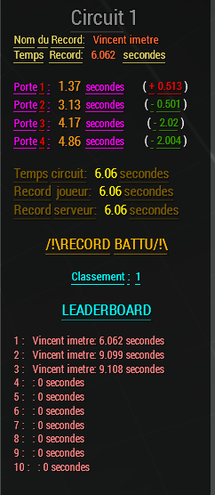

# Circuit de Course

## 1- Présentation <a id="bkmrk-page-title"></a>

### **But de ce tutoriel**

Ce script, combiné a un mapping donnera a votre Altis Life un ou plusieurs circuits de course avec chronomètre permettant aux joueurs de s'affronter au contre la montre dans le circuit.

Le script garde en mémoire les records des joueurs avec un leaderBoard de 10 personnes, le temps d'avance ou de retard.

Les joueurs recoivent une prime lorsqu'ils sont dans les 10 premiers.

Les records sont reset a chaque reboot.

### **Aperçu du résultat une fois implanté**




### **Éléments complémentaires à télécharger \(Obligatoire\)**

Vous devez maintenant **télécharger** les scripts

`Altis_life.Altis\Scripts\Circuit\Verification.sqf`


Niveau de difficulté : **Difficile**  
Temps requis : **20 minutes**


## 2- Installation <a id="bkmrk-page-title"></a>

### **Fichiers concernés** 

* `Altis_life.Altis\core\scripts\Circuit\Verification.sqf`

### **Mise en place**

1- **Téléchargez** le fichier et **placez**-le dans le chemin indiqué.

2- **Mapper** un ou plusieurs circuits avec une ligne d'arrivée et des checkpoints sur votre map.

3- **Placez** un trigger de **grande taille** a chaque checkpoints et **nommez**-les `trigger_`_`NumeroCircuit`_`_`_`NumeroPorte`_


Si les triggers sont trop petits, ils ne se déclencheront pas toujours lorsque le joueur les traversent avec un grande vitesse!


EXEMPLE:

Le premier circuit comportant 5 triggers:

Le premier trigger sur la ligne d'arrivée sera `trigger_1_0`

Le second trigger du checkpoint 1 sera `trigger_1_1`

Le dernier trigger des checkpoints sera `trigger_1_4`

Le premier circuit comportant 5 triggers:

Le premier trigger sur la ligne d'arrivée sera `trigger_2_0`

Le second trigger du checkpoint 1 sera `trigger_2_1`

Le dernier trigger des checkpoints sera `trigger_2_4`

4- **Placez** un héliport invisible que vous nommerez `SERVER`

5- **Configurez** les triggers comme ceci:


6- **Entrez** dans "On Activation" du trigger du circuit 1 le texte suivant:

```text
if ((vehicle player isKindOf "car") && ((player distance ThisTrigger)<(((triggerArea ThisTrigger)select 0 ) max ((triggerArea ThisTrigger)select 1 )*1.5)))then {player setVariable["Circuit",1,true];ThisTrigger call compile preprocessFileLineNumbers 'core\scripts\Circuit\Verification.sqf';}; 
```

 Pour le circuit 2 **entrez**:

```text
if ((vehicle player isKindOf "car") &&((player distance ThisTrigger)<(((triggerArea ThisTrigger)select 0 ) max ((triggerArea ThisTrigger)select 1 )*1.5)))then {player setVariable["Circuit",2,true];ThisTrigger call compile preprocessFileLineNumbers 'core\scripts\Circuit\Verification.sqf';};
```


 Il est possible de mettre un nombre illimité de circuits



 L'installation est maintenant finie, libre a vous de modifier le script qui est perfectible et de me contacter si vous le faites avec succès.


 ****

