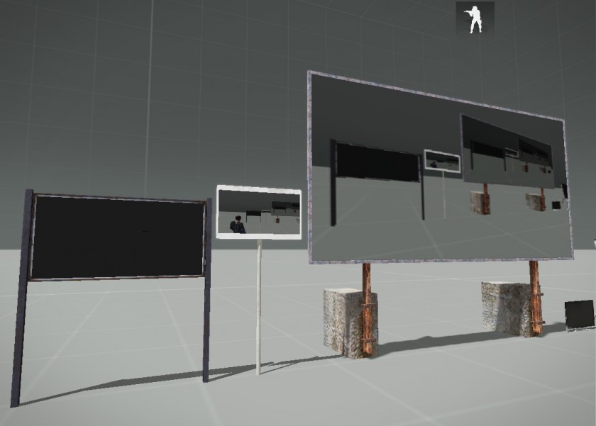

# Gopro Et Caméra De Sécurité

## 1- Présentation <a id="bkmrk-page-title"></a>

### **But de ce tutoriel**

 Ce tutoriel a pour but de permettre l installation d'un centre de contrôle pour la gendarmerie afin d'avoir le visuel sur les caméra qui seront installées sur l'île mais également sur les gopros que possèderons les policiers.


Le système de "RenderToTexture" n'est pas de mon développement! Je n'est fait que adapter ce script pour du altis-life, ajouter le système de caméra et simplifier la mise en place du système!


### **Aperçu du résultat une fois implanté**



### **Éléments à télécharger**

Vous devez maintenant **télécharger** les scripts suivants:













Niveau de difficulté : **Moyen**  
Temps requis : 30 **minutes**


## 2- Installation <a id="bkmrk-page-title"></a>

### **Fichiers concernés** 

* `Altis_Life.Altis\init.sqf`
* `Altis_Life.Altis\Scripts\Gopro\Traitement_gopro.sqf`
* `Altis_Life.Altis\Scripts\Gopro\Direct_gopro.sqf`
* `Altis_Life.Altis\Scripts\Gopro\standby.jpg`
* `Altis_Life.Altis\Scripts\Gopro\standby_sat.jpg`
* `Altis_Life.Altis\Init\Init_Gopro.sqf`

### **Mise en place**

1- **Vérifiez** que vos policiers se nomment bien `cop_X` avec X allant de 1 à N et sans interruptions.


 Si il y a une interruption, les policiers après celle-ci ne seront pas pris en compte par le programme.



Exemple: Pour 5 policiers: cop\_1, cop\_2, cop\_3, cop\_4, cop\_5.


 2- **Créez** des écrans \(ou tout objets pouvant recevoir une texture\) et **nommez-les** `monitor_X` avec X un entier de 1 à l'infini sans interruptions.  
****


Pour 6 écrans: monitor\_1, monitor\_2, monitor\_3, monitor\_4, monitor\_5, monitor\_6.


3- **Créez** des caméras `"Land_HandyCam_F"` et placez-les dans vos endroits à surveiller par les forces de police. **Nommez-les**`camera_X` avec X un entier de 1 à 40 sans interruptions.  



Pour avoir plus de caméras disponibles, **changez** le programme `Altis_Life.Altis\Scripts\Gopro\Direct_gopro.sqf` a partir de la ligne 105.


4- **Créez** un Héliport invisible et nommez-le `SERVEUR` \(Il permet de gérer les écrans si vous l'oubliez, rien ne marche\)

5- **Téléchargez**  `Traitement_gopro.sqf` et placez le dans  **`Altis_Life.Altis\Scripts\Gopro\Traitement_gopro.sqf`**

6- **Téléchargez**  `Direct_gopro.sqf` et placez le dans  **`Altis_Life.Altis\Scripts\Gopro\Direct_gopro.sqf`**

7- **Téléchargez**  `standby.jpg` et placez le dans  **`Altis_Life.Altis\Scripts\Gopro\standby.jpg`**

8- **Téléchargez**  `standby_sat.jpg` et placez le dans **`Altis_Life.Altis\Scripts\Gopro\standby_sat.jpg`**

9- **Téléchargez**  **`Init_Gopro.sqf`** et placez le dans  **`Altis_Life.Altis\Init\Init_Gopro.sqf`**

10- **Ajoutez** la ligne suivant dans votre _**`init.sqf`**_



```text
execVM "Init\Init_Gopro.sqf";
```



\*\*\*\*

Tutoriel proposé par Vincent Bénet \( [Vincentimetr](https://altisdev.com/u/vincentimetr/) \)

