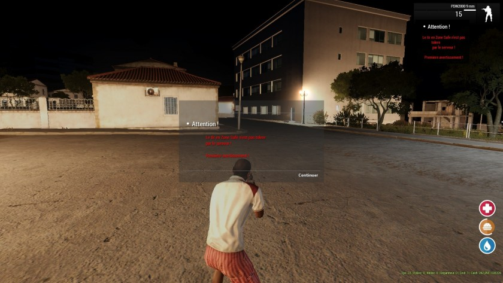
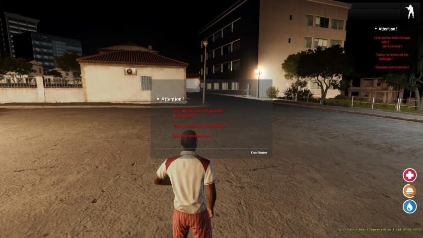
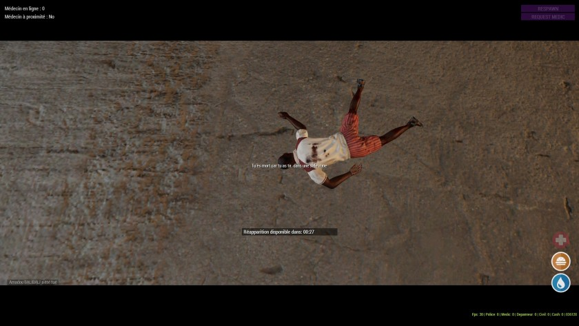

# SafeZone + Anti-Tirs + Messages

## 1- Présentation <a id="bkmrk-page-title"></a>

### **But de ce tutoriel:**

Ce script qui vous permettra d’avoir votre SafeZone fonctionnelle.  
C’est à dire que le civil:

- Tire une première fois: Il aura un message d’avertissement.  
- Il tire une deuxième fois: Il aura un message d’avertissement et il perdra toutes ses armes.  
- Il tire une troisième fois: Il meurt.

Pour les Cops, les tirs en Safe-Zone sont autorisés.

### **Aperçu du résultat une fois implanté:**







### **Éléments à télécharger:**



Et à placer dans : 

 `Altis_life.Altis\scripts\safezone.sqf`


Niveau de difficulté : **Facile**  
Temps requis : **15 minutes**


## 2 - Installation et configuration <a id="bkmrk-page-title"></a>

### **Fichiers concernés:**

* **`Altis_Life.Altis\mission.sqm`**
* **`Altis_Life.Altis\scripts\safezone.sqf`**
* **`Altis_Life.Altis\init.sqf`**
* **`Altis_Life.Altis\core\configuration.sqf`**

### \*\*\*\*

### **Mise en place:**


**Pour ceux qui ont déjà la safezone sur leur map, passer directement au point 4 !**


**1 -** **Ouvrez** votre  `Altis_Life.Altis\`**`mission.sqm`**   avec l’éditeur Arma III

**2 -** **Insérez** un marqueur =&gt; Ellipse =&gt; Entrez un nom “safepyrgos” et Axe A et B = 400

**2bis:** Faites de même avec d’autres SafeZones que vous souhaitez insérer sur votre map.

**3 -** **Sauvegardez** votre mission.

**4 -** **Créez** un dossier “scripts” à la racine de votre serveur " `Altis_Life.Altis\`**`scripts`** "

**5-** Téléchargez le fichier **`safezone.sqf`**  et insérez le dans votre dossier `Altis_Life.Altis\`**`scripts`** que vous avez créé à l’étape 4.


N’oubliez pas de renseigner les marqueurs qui ce situe à la ligne 12 du script.


`[“Nom_De_Votre_Marqueur”, Taille_De_La_Zone_Safe]`


_Exemple_: **\[“ZoneSafe\_Kavala”, 900\]**


**6-** **Allez** dans `Altis_Life.Altis\`**`init.sqf`** **ajoutez** :

```text
[] execVM "scripts\safezone.sqf";
```

**7-** Et enfin, allez dans `Altis_Life.Altis\core\`**`configuration.sqf`** et dans la section “_Backend Variables_” mettez cette ligne:

```text
life_advert = 0;
```

### \*\*\*\*

### **Configuration:**

Dans le fichier `Altis_Life.Altis\core\`**`configuration.sqf`** , pour la ligne  `life_advert = 0;` ****

Laissez “0” pour que le script exécute les 3 étapes, mettez “1” si vous voulez la personne tire pour la première fois se vois retirer toutes ses armes et “2” si vous voulez que la personne meurt d’office

## 3 - Problèmes récurrents <a id="bkmrk-page-title"></a>

Attention que le nom des marqueurs en Safe-Zone \(sur votre map\) correspondent bien avec le nom que vous avez formulé dans le fichier  `Altis_life.Altis\scripts\`**`safezone.sqf`**   à la ligne 12.

